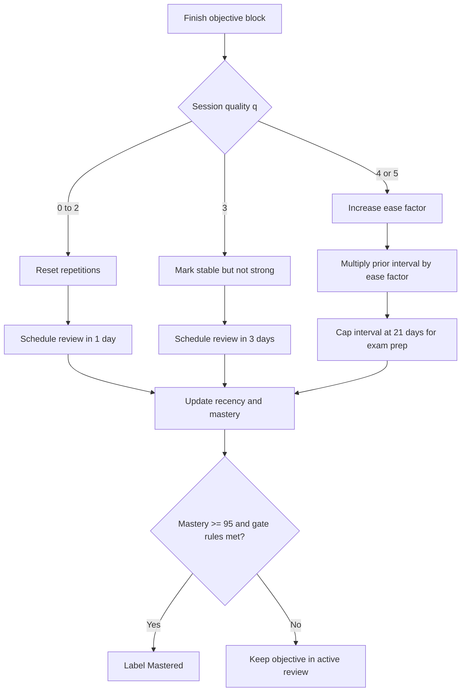
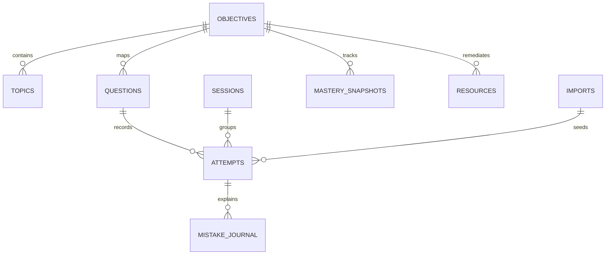

# Security Plus SY0-701 Local Web App Planning Report

## Executive summary

- **Your core idea is sound, but it should be framed as a mastery trainer rather than a simple practice-test app.** CompTIA’s current Security+ exam is SY0-701 / V7, with a maximum of 90 questions, a mix of multiple-choice and performance-based questions, 90 minutes, and five weighted domains. A sectioned, objective-based trainer maps cleanly to that structure. citeturn24view0turn9view0turn9view1
- **The most important design decision is content governance, not front-end polish.** CompTIA explicitly warns candidates away from “actual exam questions,” “real practice questions,” pass guarantees, and other unauthorized materials; its objectives PDF also states that examples are not exhaustive and that reproduction or dissemination is prohibited without written consent. That means the app should be built from the official objectives, legitimate references, and original questions or simulations. citeturn19view1turn19view0turn9view0turn15view0
- **A high-value app should track mastery by objective, not just percentage correct.** Retrieval practice and distributed practice are among the most effective learning techniques, so the app should combine block quizzes, explanations, spaced review, and objective-level readiness scoring instead of a flat score counter. citeturn28view0turn28view1turn28view2
- **The best execution order is: official objective map → legal content policy → MVP quiz engine → mastery tracker → PBQ-style simulations → full timed blocks.** That order reduces copyright risk, prevents bad data design, and gives you something useful early while preserving room for richer features later. citeturn9view0turn20view2turn1search1

The direct answer is yes: this is a good plan, but only if the app is grounded in the official SY0-701 objective map and avoids becoming a container for scraped or copied question banks. The right product is a **local-only Security+ objective trainer** with original questions, objective tags, remediation links, spaced review, and a defensible readiness model. citeturn24view0turn19view1turn20view2

## Exam blueprint and taxonomy

CompTIA’s official objectives should be the canonical backbone for the app. The exam currently uses five domains with these weights: General Security Concepts 12%, Threats, Vulnerabilities, and Mitigations 22%, Security Architecture 18%, Security Operations 28%, and Security Program Management and Oversight 20%. The official objectives also state that the example lists are **not exhaustive**, so the taxonomy should preserve the official structure while allowing more examples and remediation resources underneath it. citeturn9view0turn24view0

### Domain blueprint

| Domain ID | Domain | Weight | Objective IDs |
|---|---|---:|---|
| `D1` | General Security Concepts | 12% | `D1.O1`–`D1.O4` |
| `D2` | Threats, Vulnerabilities, and Mitigations | 22% | `D2.O1`–`D2.O5` |
| `D3` | Security Architecture | 18% | `D3.O1`–`D3.O4` |
| `D4` | Security Operations | 28% | `D4.O1`–`D4.O9` |
| `D5` | Security Program Management and Oversight | 20% | `D5.O1`–`D5.O6` |

This domain table is taken directly from the official objectives and exam page. citeturn9view0turn24view0

### Objective registry

The table below is the recommended top-level objective registry for a machine-usable taxonomy. The app should store each objective with a stable ID, a short label, first-order official subtopics, `difficulty: "unspecified"` until calibrated from actual performance, and one or more example learning tasks. The examples column below is a design recommendation, not official exam language. The first-order subtopics are taken from the objectives PDF. citeturn11view0turn12view0turn11view1turn14view0turn13view1turn29view0

| Objective ID | Official objective | First-order official subtopics | Difficulty | Example learning tasks |
|---|---|---|---|---|
| `D1.O1` | Compare and contrast various types of security controls | Categories; Control types | unspecified | Sort example controls into category and control type |
| `D1.O2` | Summarize fundamental security concepts | CIA; Non-repudiation; AAA; Gap analysis; Zero Trust; Physical security; Deception and disruption technology | unspecified | Explain a concept in plain language; choose the best control for a scenario |
| `D1.O3` | Explain the importance of change management processes and the impact to security | Business processes impacting security operation; Technical implications; Documentation; Version control | unspecified | Identify the missing change-control artifact in a scenario |
| `D1.O4` | Explain the importance of using appropriate cryptographic solutions | PKI; Encryption; Tools; Obfuscation; Hashing; Salting; Digital signatures; Key stretching; Blockchain; Open public ledger; Certificates | unspecified | Match a data-protection requirement to a crypto approach |
| `D2.O1` | Compare and contrast common threat actors and motivations | Threat actors; Attributes of actors; Motivations | unspecified | Identify likely actor and motive from a threat vignette |
| `D2.O2` | Explain common threat vectors and attack surfaces | Message-based; Image-based; File-based; Voice call; Removable device; Vulnerable software; Unsupported systems and applications; Unsecure networks; Open service ports; Default credentials; Supply chain; Human vectors/social engineering | unspecified | Tag a scenario by vector and attack surface |
| `D2.O3` | Explain various types of vulnerabilities | Application; OS-based; Web-based; Hardware; Virtualization; Cloud-specific; Supply chain; Cryptographic; Misconfiguration; Mobile device; Zero-day | unspecified | Classify the vulnerability and propose a mitigation |
| `D2.O4` | Given a scenario, analyze indicators of malicious activity | Malware attacks; Physical attacks; Network attacks; Application attacks; Cryptographic attacks; Password attacks; Indicators | unspecified | Read logs or symptoms and identify the likely attack pattern |
| `D2.O5` | Explain the purpose of mitigation techniques used to secure the enterprise | Segmentation; Access control; Application allow list; Isolation; Patching; Encryption; Monitoring; Least privilege; Configuration enforcement; Decommissioning; Hardening techniques | unspecified | Pick the best mitigation and justify why alternatives are weaker |
| `D3.O1` | Compare and contrast security implications of different architecture models | Architecture and infrastructure concepts; Considerations | unspecified | Compare tradeoffs across cloud, on-prem, container, and ICS cases |
| `D3.O2` | Given a scenario, apply security principles to secure enterprise infrastructure | Infrastructure considerations; Secure communication/access; Selection of effective controls | unspecified | Choose device placement, control type, and communication path |
| `D3.O3` | Compare and contrast concepts and strategies to protect data | Data types; Data classifications; General data considerations; Methods to secure data | unspecified | Select classification, state, and protection technique |
| `D3.O4` | Explain the importance of resilience and recovery in security architecture | High availability; Site considerations; Platform diversity; Multi-cloud systems; Continuity of operations; Capacity planning; Testing; Backups; Power | unspecified | Build a simple resiliency plan from RTO/RPO style requirements |
| `D4.O1` | Given a scenario, apply common security techniques to computing resources | Secure baselines; Hardening targets; Wireless devices; Mobile solutions; Wireless security settings; Application security; Sandboxing; Monitoring | unspecified | Harden a host or mobile scenario and identify gaps |
| `D4.O2` | Explain the security implications of proper hardware, software, and data asset management | Acquisition/procurement process; Assignment/accounting; Monitoring/asset tracking; Disposal/decommissioning | unspecified | Choose the correct asset-handling step and rationale |
| `D4.O3` | Explain various activities associated with vulnerability management | Identification methods; Analysis; Vulnerability response and remediation; Validation of remediation; Reporting | unspecified | Prioritize findings, choose next action, and validate closure |
| `D4.O4` | Explain security alerting and monitoring concepts and tools | Monitoring computing resources; Activities; Tools | unspecified | Map alerting needs to the right monitoring source or tool |
| `D4.O5` | Given a scenario, modify enterprise capabilities to enhance security | Firewall; IDS/IPS; Web filter; Operating system security; Secure protocols; DNS filtering; Email security; File integrity monitoring; DLP; NAC; EDR/XDR; User behavior analytics | unspecified | Select the enterprise control change that best reduces risk |
| `D4.O6` | Given a scenario, implement and maintain identity and access management | Provisioning/de-provisioning; Permission assignments and implications; Identity proofing; Federation; SSO; Interoperability; Attestation; Access controls; MFA; Password concepts; PAM tools | unspecified | Configure the right IAM pattern for a business scenario |
| `D4.O7` | Explain the importance of automation and orchestration related to secure operations | Use cases of automation and scripting; Benefits; Other considerations | unspecified | Decide when automation helps and where it introduces risk |
| `D4.O8` | Explain appropriate incident response activities | Process; Training; Testing; Root cause analysis; Threat hunting; Digital forensics | unspecified | Order the IR steps and identify evidence-handling requirements |
| `D4.O9` | Given a scenario, use data sources to support an investigation | Log data; Data sources | unspecified | Correlate logs, dashboards, scans, and packet captures |
| `D5.O1` | Summarize elements of effective security governance | Guidelines; Policies; Standards; Procedures; External considerations; Monitoring and revision; Types of governance structures; Roles and responsibilities for systems and data | unspecified | Identify which governance artifact or role is missing |
| `D5.O2` | Explain elements of the risk management process | Risk identification; Risk assessment; Risk analysis; Risk register; Risk tolerance; Risk appetite; Risk management strategies; Risk reporting; Business impact analysis | unspecified | Compute basic risk values and recommend a treatment |
| `D5.O3` | Explain the processes associated with third-party risk assessment and management | Vendor assessment; Vendor selection; Agreement types; Vendor monitoring; Questionnaires; Rules of engagement | unspecified | Evaluate a vendor package and choose missing controls |
| `D5.O4` | Summarize elements of effective security compliance | Compliance reporting; Consequences of non-compliance; Compliance monitoring; Privacy | unspecified | Distinguish compliance reporting, monitoring, and privacy roles |
| `D5.O5` | Explain types and purposes of audits and assessments | Attestation; Internal; External; Penetration testing | unspecified | Classify the assessment type and likely purpose |
| `D5.O6` | Given a scenario, implement security awareness practices | Phishing; Anomalous behavior recognition; User guidance and training; Reporting and monitoring; Development; Execution | unspecified | Build a short awareness response plan for a scenario |

### Recommended machine schema

The objective registry above is only the top layer. The production taxonomy should decompose every official nested bullet into a **leaf row** with a stable topic ID and parent relationship. The official PDF supports this because it lists objectives and nested bullets explicitly, and CompTIA also publishes a dedicated acronym list plus a sample hardware/software list for lab creation. citeturn11view0turn12view0turn11view1turn14view0turn13view1turn14view2turn14view3turn15view0

| Field | Purpose | Example |
|---|---|---|
| `domain_id` | stable domain key | `D4` |
| `objective_id` | stable objective key | `D4.O6` |
| `topic_id` | stable leaf key | `D4.O6.T15` |
| `parent_topic_id` | nested relationship | `D4.O6.T14` |
| `official_path` | canonical path | `4.6 > MFA > Factors > Something you have` |
| `title` | display title | `Something you have` |
| `tags` | app search/filter tags | `["iam","mfa","possession-factor"]` |
| `difficulty` | initial level | `unspecified` |
| `learning_task` | micro-task | `Distinguish possession vs. knowledge factors` |
| `source_basis` | provenance | `["CompTIA Objectives PDF"]` |

### Sample leaf rows

| Topic ID | Official path | Tags | Difficulty | Example learning task |
|---|---|---|---|---|
| `D1.O2.T20` | `1.2 > Zero Trust > Control Plane > Adaptive identity` | `["zero-trust","control-plane","adaptive-identity"]` | unspecified | Explain how adaptive signals change access decisions |
| `D2.O2.T31` | `2.2 > Human vectors/social engineering > Business email compromise` | `["social-engineering","bec","email"]` | unspecified | Identify why BEC is the best label for the scenario |
| `D3.O2.T18` | `3.2 > Firewall types > Next-generation firewall` | `["network-security","firewall","ngfw"]` | unspecified | Select NGFW vs. WAF for the given risk |
| `D4.O3.T14` | `4.3 > Analysis > Confirmation > False positive` | `["vuln-management","analysis","false-positive"]` | unspecified | Decide whether a scanner hit should be closed or escalated |
| `D4.O6.T24` | `4.6 > SSO > SAML` | `["iam","sso","saml","federation"]` | unspecified | Match SAML to the right federation scenario |
| `D5.O2.T19` | `5.2 > Risk management strategies > Mitigate` | `["risk","risk-treatment","mitigate"]` | unspecified | Choose mitigation over transfer or acceptance |

A separate **acronym dataset** is also warranted because the official objectives include a substantial acronym list and explicitly tell candidates to attain a working knowledge of those acronyms. citeturn14view3turn15view0

## Source audit

A good Security+ trainer should separate sources into three buckets: **canonical exam sources**, **primary remediation sources**, and **supplemental study products**. The safest ordering is to put official CompTIA materials first, then primary technical standards and vendor docs, then reputable commercial study products, then reputable free creators. citeturn24view0turn19view1turn19view0

### Recommended source stack

| Priority | Source | URL | Use in the app | Usage / licensing note |
|---|---|---|---|---|
| Highest | CompTIA Security+ exam page | `https://www.comptia.org/en-us/certifications/security/` | exam facts, weights, current version | Official source; use as canonical exam metadata |
| Highest | CompTIA SY0-701 objectives PDF | `https://assets.ctfassets.net/82ripq7fjls2/6TYWUym0Nudqa8nGEnegjG/0f9b974d3b1837fe85ab8e6553f4d623/CompTIA-Security-Plus-SY0-701-Exam-Objectives.pdf` | taxonomy backbone | Official source; examples not exhaustive; reproduction restricted |
| Highest | CompTIA CertMaster Learn | `https://www.comptia.org/en-us/resources/certmaster-training/learn/` | official learning path reference | Official product; licensed access |
| Highest | CompTIA CertMaster Practice | `https://www.comptia.org/en-us/resources/certmaster-training/practice/` | official adaptive practice reference | Official product; licensed access |
| Highest | CompTIA CertMaster Labs | `https://www.comptia.org/en-us/resources/certmaster-training/labs/` | official lab reference | Official product; licensed access |
| High | CompTIA Learning Products License Agreement | `https://www.comptia.org/en-us/legal/product-terms/learning-products-license-agreement/` | license guardrails for paid content | Single-user, non-transferable; do not distribute or expose licensed materials |
| High | NIST Glossary | `https://csrc.nist.gov/glossary` | terminology remediation | Public information unless marked otherwise |
| High | NIST CSF 2.0 | `https://www.nist.gov/cyberframework` | governance / risk / control framing | Strong primary source for governance language |
| High | NIST SP 800-61 Rev. 3 | `https://csrc.nist.gov/pubs/sp/800/61/r3/final` | incident response remediation | Current NIST IR reference; use instead of withdrawn Rev. 2 |
| High | CVE / NVD | `https://www.cve.org/` and `https://nvd.nist.gov/vuln` | vulnerability management remediation | Primary references for vulnerability naming and detail |
| High | MITRE ATT&CK | `https://attack.mitre.org/` | threat behavior remediation | Royalty-free use allowed with MITRE copyright/license notice |
| High | OWASP Top 10 2025 | `https://owasp.org/Top10/2025/` | web/app security remediation | OWASP materials are generally open / CC-licensed |
| High | Microsoft Learn Security | `https://learn.microsoft.com/en-us/security/` | identity, cloud, ops remediation | Link freely; software/doc reuse subject to Microsoft terms |
| High | AWS Security Documentation | `https://docs.aws.amazon.com/security/` | cloud security remediation | AWS docs are CC-BY-SA-4.0; code is MIT-0 |
| High | Wireshark User’s Guide | `https://www.wireshark.org/docs/wsug_html_chunked/` | packet analysis remediation | Good primary reference for packet capture concepts |
| Medium | Professor Messer SY0-701 course | `https://www.professormesser.com/security-plus/sy0-701/sy0-701-video/sy0-701-comptia-security-plus-course/` | free video remediation | Reputable free creator; personal/informational use only under site terms |
| Medium | Wiley / Sybex Security+ Study Guide | `https://www.wiley.com/en-us/CompTIA%2BSecurity%2B%2BStudy%2BGuide%2Bwith%2Bover%2B500%2BPractice%2BTest%2BQuestions%3A%2BExam%2BSY0-701%2C%2B9th%2BEdition-p-9781394211418` | purchased study text reference | Commercial copyrighted work; permissions required for reuse |
| Medium | Wiley / Sybex Practice Tests | `https://www.wiley.com/en-us/CompTIA%2BSecurity%2B%2BPractice%2BTests%3A%2BExam%2BSY0-701%2C%2B3rd%2BEdition-p-9781394211388` | purchased bank reference | Commercial copyrighted work; use by license only |
| Medium | Pearson Security+ Cert Guide | `https://www.pearson.com/en-us/subject-catalog/p/comptia-security-sy0-701-cert-guide-1-e/P200000011884` | purchased study text reference | Commercial copyrighted work; follow vendor license |
| Medium | Pearson Exam Cram | `https://www.pearson.com/en-us/subject-catalog/p/comptia-security-sy0-701-exam-cram-7e/P200000011539/9780138225506` | purchased exam-prep reference | Commercial copyrighted work; follow vendor license |

The table above is grounded in official product pages, terms pages, and primary technical sources. CompTIA’s official study ecosystem includes Learn, Practice, Labs, Student Guide products, and bundles; NIST, MITRE, OWASP, Microsoft, AWS, CVE/NVD, and Wireshark are appropriate primary remediation sources; Professor Messer is a reputable free creator but still copyrighted under his own terms; Sybex/Wiley and Pearson are reputable commercial publishers with copyrighted content and permissions/licensing boundaries. citeturn1search0turn1search1turn2search0turn2search2turn16search3turn16search5turn16search10turn6search0turn23search0turn23search1turn23search3turn23search11turn8search2turn25view1turn25view0turn8search3turn25view3turn7search3turn26view2turn6search3turn1search3turn21view0turn1search2turn17search0turn27search0turn17search1turn17search2

### Sources to avoid

The app should explicitly reject sources that advertise **brain dumps**, **actual exam questions**, **real exam questions**, **real practice questions**, or **pass guarantees**. CompTIA says materials that are exactly the same as or substantially similar to the exam are unauthorized, and it warns that user-generated platforms can be difficult to verify even though some legitimate content may exist on them. citeturn19view1turn19view0

| Red flag | Why it is a problem |
|---|---|
| “Brain dump,” “actual exam questions,” “real test questions” | Strong indicator of unauthorized content |
| “Pass guaranteed,” “first try,” “identical simulator” | CompTIA says it does not guarantee pass outcomes |
| Very cheap “all certifications” bundles | Broad cross-vendor dump pattern; low trust |
| User-uploaded question PDFs or mega-banks without provenance | Hard to verify legality, freshness, and quality |

## Legal content strategy

This section is operational guidance for product design, not legal advice. The safest position is to treat the app as a **local teaching tool built from the official objective map and original content**, not as a container for copied commercial banks. That approach is aligned with CompTIA’s exam-security guidance and with the published license restrictions on official learning products. citeturn19view1turn20view2

### How to source and create content safely

The safest content pipeline is:

1. Use the CompTIA objectives PDF as the **taxonomy source**, not as a question source.
2. Use primary references such as NIST, MITRE ATT&CK, CVE/NVD, OWASP, Microsoft Learn, AWS docs, and Wireshark to build **concept notes and remediation links**.
3. Write **original prompts, distractors, explanations, and PBQ-style interactions** that test the objective without copying publisher text or reconstructing leaked exam items.
4. Use public-domain or openly licensed materials where possible for examples, diagrams, and reference snippets, while preserving attribution and any license requirements. NIST generally treats its web information as public information unless marked otherwise; MITRE ATT&CK allows research, development, and commercial use if its copyright/license notice is reproduced; OWASP materials are generally open or CC-licensed; AWS docs are CC-BY-SA-4.0 and code is MIT-0. citeturn25view2turn25view1turn25view0turn26view2

### Policy for importing purchased banks

The most defensible import policy is **metadata-only by default**. CompTIA’s learning products license is non-exclusive, non-transferable, non-sublicenseable, single-user, and prohibits distribution, publication, transfer, or making the software available to third parties; it also forbids uploading licensed materials to AI tools or platforms in a way that would make them generally available to the public. Professor Messer’s terms also limit content to personal informational use and prohibit copying or redistribution without consent; Microsoft documents and software have their own limits for redistribution. citeturn20view2turn21view0turn25view3

The practical policy should therefore be:

| Import type | Allow? | Rationale |
|---|---|---|
| Session scores, dates, percent correct, domain/objective tags | Yes | No copyrighted prompt text needed |
| A vendor item ID or user-created alias | Yes | Lets the app refer to an item without storing its text |
| User’s own short notes about why they missed it | Yes | User-authored content |
| Full question stem, answer options, screenshots, explanations from paid banks | No by default | Highest copyright and license risk |
| Sending paid question text to an AI model for explanation | No by default | Risky under license and redistribution rules |
| Manually recreated “similar” questions based on the objective, not the original bank text | Yes, if truly original | Safe if independently authored |

This is an inference from the published licenses and terms, but it is the right operational posture for a local-only app intended to stay on the safe side. citeturn20view2turn21view0turn27search0

### Provenance fields

Every question should carry explicit provenance so the app can filter, audit, and safely export content.

| Field | Example | Why it matters |
|---|---|---|
| `author_type` | `original` / `user-authored` / `licensed-reference` | Distinguishes safe original items from restricted items |
| `source_origin` | `CompTIA objective map`, `NIST`, `MITRE`, `Professor Messer`, `Wiley result metadata only` | Tells you what informed the item |
| `copyright_status` | `original`, `public-domain`, `cc-by-sa`, `commercial-restricted`, `unspecified` | Prevents accidental reuse |
| `license_note` | `Do not export text`, `Attribution required` | Controls export and display |
| `import_policy` | `metadata_only` / `full_text_allowed` | Enforces app rules |
| `reviewed_at` | ISO date | Auditability |
| `reviewed_by` | local user tag | Provenance hygiene |

### Acceptable PBQ simulation design

CompTIA’s exam includes performance-based questions, and the official hardware/software list says the sample list may help training companies create a lab component. That means PBQ-style training is appropriate, but it should be **original**, **generic**, and **skill-based**, not “reconstructed exam screens.” citeturn24view0turn15view0

Acceptable PBQ designs include:

- Reordering firewall rules for least privilege.
- Reviewing synthetic SIEM, endpoint, DNS, or email logs to identify an attack pattern.
- Mapping IAM requirements to SSO, MFA, federation, and PAM choices.
- Placing controls into preventive, detective, or corrective categories.
- Triage exercises using CVE severity, exposure, and business impact.
- Incident-response ordering and evidence-handling simulations.
- Data-classification and encryption-selection tasks using invented assets.

The scenario data should be synthetic or drawn from public/openly usable references, not copied from commercial practice products or suspected exam leaks. Public U.S. government materials can often be reused, but logos, endorsement implications, and protected third-party content on government sites still require care. citeturn25view2turn26view0

## Mastery scoring model

A flat score is not enough for certification prep. A better design is objective-level mastery that measures **accuracy, consistency, confidence, recency, variety, and speed**, because the strongest study methods for long-term retention are practice testing and distributed practice, not rereading alone. The exact formula below is a product-design recommendation grounded in that learning-science literature, not an official CompTIA scoring model. citeturn28view0turn28view1turn28view2

### Proposed objective mastery formula

For each objective `j`, compute six normalized metrics between `0` and `1`:

- `A_j` = recent weighted accuracy
- `C_j` = session consistency
- `F_j` = confidence calibration
- `R_j` = recency / retention freshness
- `V_j` = format variety
- `S_j` = speed relative to target

Then compute:

```text
Mastery_j = 100 * (
  0.35*A_j +
  0.20*C_j +
  0.10*F_j +
  0.15*R_j +
  0.10*V_j +
  0.10*S_j
)
```

Recommended metric definitions:

| Metric | Definition | Implementation note |
|---|---|---|
| `A_j` | Exponentially decayed correctness over recent attempts | Weight recent attempts more heavily |
| `C_j` | Fraction of the last 3 sessions on that objective with session score ≥ 0.80 | Prevents one lucky session from dominating |
| `F_j` | Confidence calibration average | High-confidence wrong answers should hurt more than low-confidence guesses |
| `R_j` | Retention freshness | Full credit when reviewed on schedule; decays if overdue |
| `V_j` | Distinct formats attempted on the objective | Count formats such as acronym, concept check, scenario, PBQ |
| `S_j` | Median time vs. target time | Cap at 1.0 so speed does not overpower correctness |

A workable confidence-calibration score per attempt is:

| Outcome | Confidence | Per-attempt score |
|---|---|---:|
| Correct | High | 1.00 |
| Correct | Medium | 0.90 |
| Correct | Low | 0.75 |
| Wrong | Low | 0.40 |
| Wrong | Medium | 0.20 |
| Wrong | High | 0.00 |

### Mastery labels

| Score | Label | Gate condition |
|---:|---|---|
| 0–14 | Not Started | no meaningful evidence |
| 15–34 | Exposed | at least one attempt |
| 35–54 | Weak | knows fragments, unstable recall |
| 55–69 | Developing | partial competence |
| 70–84 | Proficient | generally reliable |
| 85–94 | Exam Ready | strong objective performance |
| 95–100 | Mastered | only if spaced, repeated, and varied |

To avoid false confidence, the app should not award **Mastered** unless all of the following are also true:

- at least 3 sessions on different days,
- at least 7 days between the first and latest successful session,
- `A_j >= 0.90`,
- `R_j >= 0.90`,
- `V_j >= 0.67`.

That rule is a design choice, but it matches the goal of retention rather than one-time quiz success. citeturn28view0turn28view1turn28view2

### Spaced review rules

A simple and effective MVP scheduler is an SM-2-style objective schedule. Convert each objective session into a quality score `q` from 0 to 5:

| Session result | `q` |
|---|---:|
| ≥ 90% accurate, on time, confidence mostly medium/high | 5 |
| 80–89% | 4 |
| 70–79% | 3 |
| 50–69% | 2 |
| 1–49% | 1 |
| 0% or abandoned | 0 |

Then use:

```text
If q < 3:
  repetitions = 0
  interval = 1 day
Else:
  if repetitions == 0: interval = 1 day
  if repetitions == 1: interval = 3 days
  else: interval = round(previous_interval * EF)

EF' = max(1.3, EF + (0.1 - (5-q)*(0.08 + (5-q)*0.02)))
```

For exam prep, cap intervals at **21 days** in the MVP so weak topics cycle back quickly before test day. That cap is a pragmatic design choice for a finite certification horizon. citeturn28view1turn28view2

### Spaced review flow



### Example calculation

Suppose `D4.O6` IAM has these objective metrics:

- `A = 0.84`
- `C = 0.75`
- `F = 0.80`
- `R = 0.90`
- `V = 0.67`
- `S = 0.72`

Then:

```text
Mastery = 100 * (
  0.35*0.84 +
  0.20*0.75 +
  0.10*0.80 +
  0.15*0.90 +
  0.10*0.67 +
  0.10*0.72
)
= 79.8
```

That objective would be labeled **Proficient**.

### Sample dataset

| Objective ID | Attempts | Accuracy | Consistency | Confidence | Recency | Variety | Speed | Mastery | Label |
|---|---:|---:|---:|---:|---:|---:|---:|---:|---|
| `D1.O4` | 18 | 0.78 | 0.67 | 0.72 | 0.85 | 0.67 | 0.76 | 74.7 | Proficient |
| `D2.O4` | 21 | 0.61 | 0.55 | 0.48 | 0.70 | 0.67 | 0.64 | 60.2 | Developing |
| `D3.O2` | 14 | 0.73 | 0.67 | 0.70 | 0.92 | 0.50 | 0.81 | 72.0 | Proficient |
| `D4.O6` | 25 | 0.84 | 0.75 | 0.80 | 0.90 | 0.67 | 0.72 | 79.8 | Proficient |
| `D5.O2` | 11 | 0.93 | 1.00 | 0.86 | 0.95 | 0.67 | 0.88 | 91.0 | Exam Ready |

### Overall readiness score

Use the official CompTIA domain weights for the base readiness score. First compute a domain score as the mean of objective masteries in that domain, multiplied by a **coverage factor** so untouched objectives keep the score honest.

```text
CoverageFactor_d = 0.60 + 0.40 * (attempted_objectives_d / total_objectives_d)
DomainScore_d = mean(Mastery_j within domain d) * CoverageFactor_d
```

Then compute the weighted readiness:

```text
ObjectiveReadiness =
  0.12*D1 +
  0.22*D2 +
  0.18*D3 +
  0.28*D4 +
  0.20*D5
```

If timed mixed blocks exist, fold them in:

```text
OverallReadiness =
  0.80*ObjectiveReadiness +
  0.20*TimedBlockScore
```

This keeps the official domain weighting while adding a pacing reality check. CompTIA’s own exam structure justifies the use of domain weights and mixed timed blocks because the exam is timed, domain-weighted, and includes PBQs as well as multiple-choice items. citeturn24view0turn9view0

## MVP build spec

The MVP should be a **local-only web app** with no user accounts, no cloud sync, and manual JSON export/import. That matches your stated requirement and keeps both privacy and licensing risk low. citeturn20view2

### User stories

- As a learner, I want to take a 10-question block on one objective so I can study in bite-size sessions.
- As a learner, I want every question to show the tested objective, why the right answer is right, and why the distractors are weaker.
- As a learner, I want the app to remember weak areas and queue them for spaced review.
- As a learner, I want a dashboard showing mastery by domain and objective, not just a total score.
- As a learner, I want to tag mistakes by type so I can see whether I have a knowledge gap, scenario-reading problem, or terminology issue.
- As a learner, I want local export/import so my progress survives browser resets.
- As a learner, I want to keep the app offline and private, with no account creation.
- As a learner, I want PBQ-style mini-simulations later, after the basic quiz engine works.

### Recommended data model

Use **IndexedDB** for durable local storage. Use **localStorage** only for very small UI preferences such as theme, last-selected domain, and table layout.

#### Core stores

| Store | Purpose | Key fields |
|---|---|---|
| `objectives` | taxonomy registry | `objective_id`, `domain_id`, `title`, `weight`, `tags` |
| `topics` | leaf-level taxonomy | `topic_id`, `objective_id`, `parent_topic_id`, `official_path`, `tags` |
| `questions` | app-authored items | `question_id`, `objective_id`, `topic_ids`, `type`, `difficulty`, `provenance` |
| `attempts` | every user response | `attempt_id`, `question_id`, `objective_id`, `timestamp`, `correct`, `confidence`, `elapsed_ms` |
| `sessions` | grouped quiz blocks | `session_id`, `mode`, `objective_ids`, `started_at`, `ended_at`, `timed` |
| `mastery_snapshots` | latest computed mastery state | `objective_id`, `score`, `label`, `next_review_at`, `updated_at` |
| `resources` | remediation links | `resource_id`, `objective_id`, `type`, `title`, `url`, `license_note` |
| `mistake_journal` | user-facing feedback log | `journal_id`, `attempt_id`, `mistake_type`, `user_note`, `followup_task` |
| `imports` | metadata-only external results | `import_id`, `vendor`, `policy`, `imported_at`, `raw_summary_json` |

#### ER diagram



### Question schema example

```json
{
  "question_id": "Q-D4.O6-0007",
  "exam_version": "SY0-701",
  "domain_id": "D4",
  "objective_id": "D4.O6",
  "topic_ids": ["D4.O6.T24", "D4.O6.T25"],
  "type": "scenario_mcq",
  "difficulty": "unspecified",
  "prompt": "A company wants browser-based single sign-on from an identity provider to a SaaS app. Which protocol best fits?",
  "choices": [
    {"id": "A", "text": "SAML"},
    {"id": "B", "text": "SNMP"},
    {"id": "C", "text": "RADIUS"},
    {"id": "D", "text": "WPA3"}
  ],
  "correct_answers": ["A"],
  "explanation": {
    "why_correct": "SAML is commonly used for browser-based federation and SSO.",
    "why_not_others": {
      "B": "SNMP is for monitoring and management.",
      "C": "RADIUS is an AAA protocol, not the normal browser SSO assertion format.",
      "D": "WPA3 is a wireless security standard."
    }
  },
  "tags": ["iam", "sso", "saml", "federation"],
  "est_seconds": 75,
  "provenance": {
    "author_type": "original",
    "source_origin": ["CompTIA objective map", "Microsoft Learn", "Professor Messer"],
    "copyright_status": "original",
    "license_note": "safe_to_export",
    "import_policy": "n/a"
  },
  "status": "active"
}
```

### UI screens

| Screen | MVP? | Purpose |
|---|---|---|
| Dashboard | Yes | show domain/objective mastery, due reviews, weak areas |
| Taxonomy browser | Yes | browse domains → objectives → topics |
| Quiz setup | Yes | choose domain, objective, weak area, block size, timed/untimed |
| Quiz runner | Yes | present questions and capture confidence + timing |
| Review report | Yes | explanations, mistake types, remediation links, next review date |
| Mistake journal | Yes | searchable history of errors and notes |
| Resource panel | Yes | objective-linked videos, docs, glossary, labs |
| Import/export | Yes | JSON backup, restore, metadata-only results import |
| PBQ workspace | Later | simulations such as log triage or rule ordering |
| Mixed exam mode | Later | timed multi-domain blocks and readiness estimate |

### Tech stack

A minimal but durable stack is:

- **React + TypeScript + Vite** for fast local development and clean stateful UI.
- **Dexie** as a thin IndexedDB wrapper.
- **Zod** for schema validation on imports and question JSON.
- **React Router** for screen routing.
- **A small chart library** for the dashboard, or native SVG if you want to stay very lean.
- **No backend** and **no analytics** in the MVP.

Vanilla JavaScript is viable for a proof of concept, but once you add mastery math, imports, filtered dashboards, and PBQ components, React becomes the more maintainable option. That is a design recommendation rather than a sourced fact.

### Import, export, backup, and privacy

- Export the full local state as a signed JSON snapshot.
- Support restore from JSON with schema validation and version migration.
- Keep a one-click “safe export” and an optional “anonymized export.”
- Do not store credentials or enable sync in the MVP.
- Treat imported files as untrusted: validate schema, size, and allowed fields.
- Do not execute imported scripts or HTML.
- If you later add AI explanations, keep it off by default and never send restricted commercial question text out of the local environment.

### Phased roadmap

| Phase | Deliverables | Relative effort |
|---|---|---|
| Foundation | objective registry, topic schema, provenance model, resource catalog | M |
| MVP quiz engine | quiz setup, runner, explanations, attempts, local save | L |
| Mastery layer | scoring engine, due-review queue, dashboard, labels | M |
| Remediation layer | mistake journal, resource links, study suggestions | M |
| Metadata import/export | backup/restore, vendor-result sidecars, validation | M |
| PBQ phase | rule-ordering, log triage, IAM decision, IR workflow simulations | XL |
| Exam mode | timed mixed blocks, pacing analytics, readiness estimate | L |
| Polish | accessibility, keyboard flows, packaged offline build | M |

## Content plan and execution sequence

Quality matters more than raw volume. The exam is timed and includes PBQs, but the official objectives and remediation references are broader than any single item bank. A good target is a modest, high-quality corpus that is clearly tagged and explained. CompTIA also publishes a substantial acronym list, which justifies a dedicated acronym-drill mode. citeturn24view0turn14view3turn15view0

### Recommended content counts

| Content type | Target count | Why this count makes sense |
|---|---:|---|
| Acronym drills | 250–350 | The official acronym list is long enough to justify a dedicated recall bank |
| Objective checks | 280–420 | Roughly 10–15 concise items per objective across 28 objectives |
| Scenario MCQs | 220–320 | Needed to train best-answer reasoning and domain integration |
| PBQ-style simulations | 35–60 | Fewer in number, but high instructional value |
| Weak-area retests | generated | Pull dynamically from mistakes and due reviews |
| Mixed timed blocks | generated | Built from the tagged bank with domain weighting |

These counts are product recommendations, not official requirements. The rationale is to cover the official map while preserving enough variation to prevent memorization effects. citeturn24view0turn9view0turn28view0turn28view1

### Sample content templates

| Template type | Pattern | Good use |
|---|---|---|
| Acronym drill | “What does `DKIM` help validate in email security?” | rapid recall and terminology |
| Objective check | “Which control is detective rather than preventive?” | objective-level conceptual precision |
| Scenario MCQ | “A finance team needs browser SSO to a SaaS provider with centralized identity. Which protocol fits best?” | best-answer reasoning |
| PBQ triage | “Review synthetic logs and choose the most likely attack plus next action” | investigation support |
| PBQ controls | “Reorder firewall rules to enforce least privilege and isolate management access” | enterprise security capabilities |
| PBQ IR flow | “Place the IR steps in the correct order and identify the chain-of-custody requirement” | operations and oversight |

### Remediation link patterns

A remediation link should be tied to the objective, not just to a broad domain.

| Objective | Best remediation pattern | Example references |
|---|---|---|
| `D1.O4` cryptography | official objective + glossary + clear explainer | CompTIA objective PDF; NIST glossary; Professor Messer crypto module |
| `D2.O4` malicious indicators | official objective + MITRE ATT&CK + CISA ransomware guidance | CompTIA objective PDF; MITRE ATT&CK; StopRansomware |
| `D3.O2` secure infrastructure | official objective + Microsoft/AWS/vendor primary docs | CompTIA objective PDF; Microsoft Learn security; AWS Security Documentation |
| `D4.O3` vulnerability management | official objective + CVE/NVD + NIST | CompTIA objective PDF; CVE; NVD; NIST |
| `D5.O2` risk management | official objective + NIST CSF 2.0 | CompTIA objective PDF; NIST Cybersecurity Framework |

These remediation patterns are aligned to primary or official sources, which is the safest way to keep the app useful without copying proprietary prep content. citeturn9view0turn6search0turn1search3turn8search2turn23search2turn8search3turn7search3turn23search3turn23search11turn23search0

### Recommended execution order

The cleanest execution order is:

1. **Lock the official taxonomy** from the objectives PDF.
2. **Set the legal/provenance policy** before any content import.
3. **Build the local MVP quiz engine** with explanations and attempt logging.
4. **Add mastery scoring and spaced review**.
5. **Add remediation links and the mistake journal**.
6. **Add original PBQ-style simulations**.
7. **Add mixed timed blocks and readiness reporting**.

That order reduces rework because the taxonomy, provenance, and mastery logic are the long-term foundations; the UI can evolve around them. citeturn9view0turn20view2turn28view0turn28view1

### Open questions and limitations

A few details remain genuinely unspecified or should be treated cautiously:

- **Difficulty calibration is unspecified** in the official objectives. The report therefore uses `difficulty: "unspecified"` until your own item statistics justify easy/medium/hard labels. citeturn9view0
- **Publisher-specific reuse permissions vary.** For commercial products such as CompTIA learning products, Sybex/Wiley, Pearson, and creator-owned materials, the safest default is to avoid ingesting or redistributing full item text unless a license explicitly permits it. citeturn20view2turn21view0turn27search0
- **This report does not reproduce full copyrighted commercial banks or full official objective text beyond limited summarization.** That is deliberate and appropriate given CompTIA’s exam-security guidance and the copyright notices on the official objectives. citeturn19view1turn15view0

The short recommendation is this: **build the app around the official SY0-701 objective map, original question content, and objective-level mastery tracking; do not try to win by collecting “a bunch of practice exams.”** A smaller, legally clean, strongly tagged bank with explanations, spaced review, and PBQ-style simulations will prepare you better for Security+ than a large but dubious question dump. citeturn19view1turn24view0turn28view0turn28view1